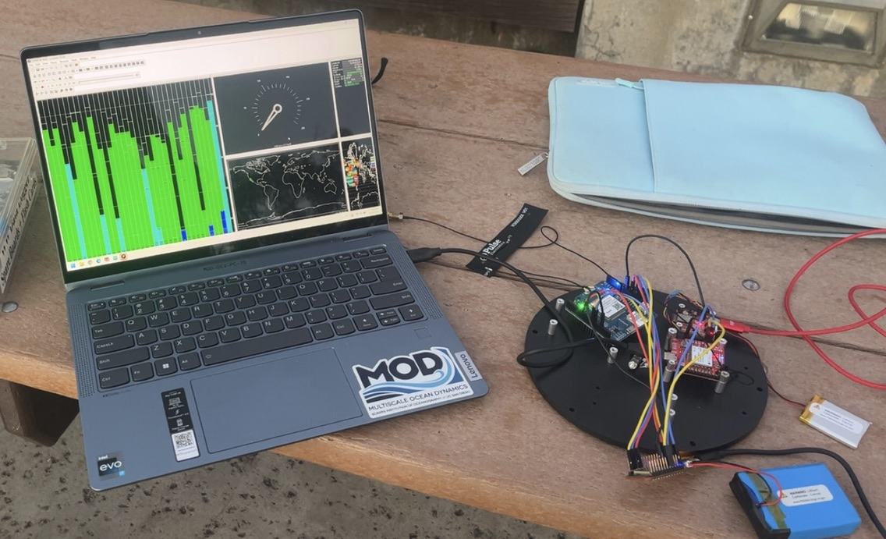

# Hey, I'm Amara 

Electrical engineering student passionate about computer and embedded systems. I love working at the intersection of hardware and software, whether it's firmware for microcontrollers or debugging low-level code.

## What I Work With

**Languages:** Python, C/C++, LEGv8 Assembly, Verilog  
**Embedded Platforms:** ESP32, Arduino, FPGA (Vivado)  
**Tools & Frameworks:** ROS2, OpenCV, MATLAB, AutoCAD, OnShape  
**Protocols:** I2C, SPI, UART, UBX, RTCM, NTRIP

## Featured Projects

### Marine RTK GPS Buoy (Scripps MPL)

An autonomous marine buoy for oceanographic research, combining ESP32 firmware, a u-blox ZED-F9P RTK GPS, a SIM7000 LTE modem, and an OpenLog Artemis IMU. Streams NTRIP corrections over cellular to achieve 0.97 cm horizontal precision and a 94% RTK fix rate over a 7.5-hour autonomous field test. Presented at IEEE Rising Stars 2026.

### Satellite Cyber Attack & Defense (Viasat SAT-CyAD)
Built reliability infrastructure for a live GOES weather satellite ground station, sponsored by Viasat under the US Space Force Hybrid Space Architecture initiative. Designed systemd services, a 3-layer fault simulation system, and a JSON evidence pipeline mapped to the SPARTA threat framework.

### Autonomous RC Car
ROS2 and OpenCV-based perception and control for a 1/10-scale self-driving car. Used Docker to coordinate simulation (Donkey-Sim) and hardware (Jetson Nano) environments.

## Currently Exploring

- PCB design
- AI and machine learning coursework
- Low-level systems programming

## Let's Connect

- [LinkedIn](https://www.linkedin.com/in/amaraihek)
- amaraihek12@gmail.com
